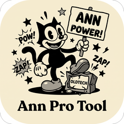
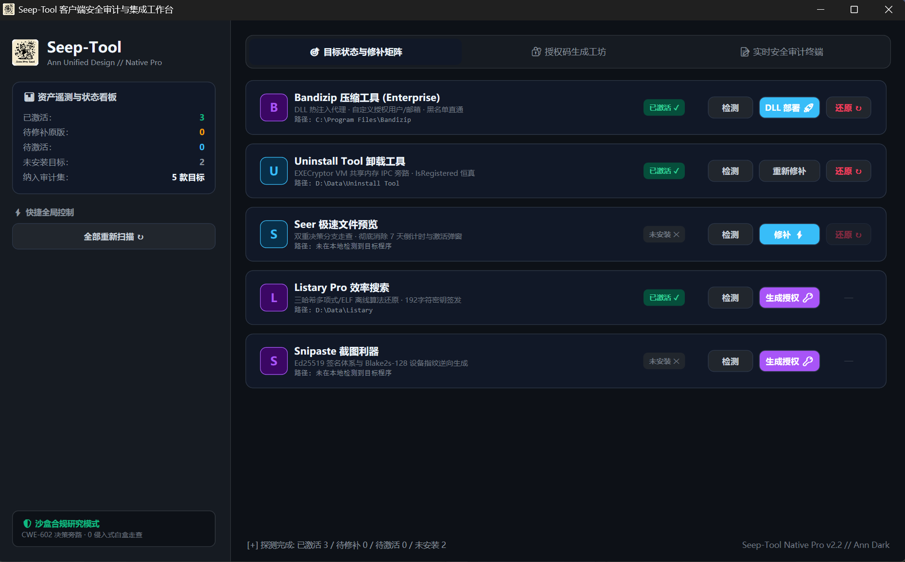

<p align="center">
  
</p>

<h1 align="center">Seep-Tool</h1>

<p align="center">
  <strong>Client-Side Authorization Audit · CWE-602 Decision Bypass · Autonomous Security Workbench</strong>
</p>

<p align="center">
  <strong>WPF Native Pro  · 单文件 EXE · 零运行时依赖</strong>
</p>

<p align="center">
  <a href="https://github.com/angusdevgo/Seep-Tool"></a>
  <a href="https://github.com/angusdevgo/Seep-Tool/blob/main/LICENSE"></a>
  
  
  
  <a href="https://linux.do/"></a>
</p>

<p align="center">
  <a href="#-project-overview">Overview</a> •
  <a href="#-core-targets--vulnerabilities">Target Matrix</a> •
  <a href="#-ui-design--features">UI Showcase</a> •
  <a href="#-technical-architecture">Architecture</a> •
  <a href="#-quick-start">Quick Start</a> •
  <a href="#-directory-structure">Directory</a> •
  <a href="#-disclaimer">Disclaimer</a>
</p>

---

## 🌟 Project Overview

**Seep-Tool** 是专为客户端安全研究、逆向工程学术验证与白盒逻辑审计打造的独立原生桌面工作台。

本项目聚焦 **CWE-602（客户端强行实施服务端安全机制 / Client-Side Enforcement of Server-Side Security）** 典型缺陷，深度归纳并实装了对主流 Windows 桌面软件的四大主流逆向与鉴权旁路范式：

1. **DLL 劫持与热注入代理 (DLL Hijacking Proxy)**：通过符号透明转发实施运行时 IAT Hook 与内存热补丁，**完好保留官方 Authenticode 数字签名**；
2. **PE 控制流微创重定向 (Binary Call Redirection)**：针对被强混淆/虚拟化保护的宿主组件，改写封装决策入口；
3. **多重决策分支走查 (Dual-Branch Function Patching)**：穿透多层拦截判定，彻底阻断试用倒计时与模态弹窗；
4. **离线高阶密码学算法全还原 (Cryptographic Keygen / Signing)**：涵盖三哈希（滚动哈希/ELF/轮异或）位流映射与 Ed25519 + Blake2s-128 设备指纹本地离线签发。

---

## 🎯 Core Targets & Vulnerabilities

| 目标软件 | 审计范式 | 漏洞成因与技术方案 (CWE-602) | 交付形态 |
|:---|:---:|:---|:---:|
| **Bandizip** *(Enterprise)* | **DLL 热注入代理** | 通过 `version.dll` 符号转发劫持，在主模块入口执行前同步施加 3 处内存热补丁（STD/PRO 回退分支改写为 ENT、服务端黑名单核验直通），并通过 IAT Hook 挂钩 `SetDlgItemTextW(0x527)` 动态注入自定义授权名与邮箱，**完好保留官方 Authenticode 数字签名**。 | `version.dll` + `ini` 配置 |
| **Uninstall Tool** | **PE 调用重定向** | 鉴权内核受 EXECryptor VM 强保护并依赖 IPC。通过将主程序 `call atoi(json["result"])`（VA `0x140009E0F`）重定向到 `.text` 空隙的 `mov eax,3; ret` 打桩地址，使 `IsRegistered` 判定恒真。 | 原位微创修补 + 注册表写入 |
| **Seer** | **双点决策走查** | 针对新版两级判定：一是 `AppLicenser::isLicensed`（文件偏移 `0x496C10`）打桩为 `mov al,1; ret`；二是拦截 `0x495B70` 的试用倒计时与购买弹窗封装函数打桩为 `xor eax,eax; ret`，**彻底消除“7天后停止运行”及授权码模态弹窗**。 | 双点入口打桩 + 状态自愈 |
| **Listary Pro** | **三哈希算法还原** | 逆向还原 `LicenseChecker` 校验链：提取 192 字符密钥中 `[160:179]` 核心 19 位校验段，重现 H1(多项式×43)、H2(ELF变种)、H3(四轮异或) 混合拼装 96-Bit 整数及 5-Bit Base32 编码映射，支持任意自定义邮箱。 | 纯离线算法 100% 还原 |
| **Snipaste 2.11.3 PRO** | **Ed25519 签名体系** | 逆向提取内嵌官方公钥密文及 16 字节周期 Keystream，替换为本地私钥配套公钥；推导 Windows `MachineGuid` 的 Blake2s-128 硬件哈希与相邻 ASCII 差校验和；生成带 Gzip 压缩及 Sig XOR 混淆的官方同构激活码。 | 本地公钥替换 + 离线签发 |

---

## 📸 UI Design & Features

<div align="center">
  
</div>

### 1. 深度对齐 IDM Pro Tool 的黑曜石设计规范
- **沉浸式 DWM 深色标题栏**：无缝调用 Windows 11 原生圆角视窗（`DWMWCP_ROUND`）与沉浸式暗色标题栏，杜绝传统刺眼的白色窗体边框；
- **左侧 320px 专业遥测侧边栏**：搭载 Ann 极客发光图标，实时展示已激活 🟢 / 待激活 🔑 / 未安装 ⚪ 的资产统计看板；
- **严格表格化 6 列等高对齐**：每个目标卡片固定拆分为 `Icon`、`名称与路径`、`状态胶囊 (112px)`、`检测列 (70px)`、`修补/生成列 (92px)`、`还原列 (70px)`，彻底消除拥挤换行；
- **操作 Toast 浮动通知**：操作完成后在右下角弹出带阴影的状态气泡，2.8 秒自动渐变消失；
- **原地异步响应**：全后台工作线程执行，点击检测或修补瞬间按钮变更为 `...` 忙碌态，卡片胶囊原地刷新，主界面永不假死。

### 2. 单体独立还原（Revert）引擎
彻底摒弃“全部还原”的粗暴模式，在每个补丁目标的右侧独立配备专属的 **`还原 ↻`** 按钮：
- **Bandizip**：一键安全卸除 `version.dll` 代理及临时配置，原版校验完好；
- **Uninstall Tool**：仅由原件 `.orig.exe` 恢复主程序，并自动清理注册表 `RN/RC` 授权键；
- **Seer**：由专属备份 `.bak` 一键还原官方原版二进制；
- **智能互锁保护**：仅当检测到目标处于已激活状态时按钮方可点击，未激活或未安装自动置灰防误触。

---

## ⚙️ Technical Architecture

```
┌───────────────────────────────────────────────────────────────────┐
│        WPF MainWindow (Ann Retinomorphic Dark UI)                 │
│  ┌───────────────┬─────────────────────────────────────────────┐  │
│  │ 左侧 320px 边栏 │ 🎯 目标修补矩阵 │ 🔐 授权码生成 │ 📝 审计日志 │  │
│  │ 实时遥测仪表盘 │ 严格 6 列表格化对齐 (状态│检测│修补│还原)     │  │
│  └───────────────┴─────────────────────────────────────────────┘  │
└─────────────────────────────────┬─────────────────────────────────┘
                                  │
┌─────────────────────────────────▼─────────────────────────────────┐
│       DetectionEngine (统一确定性检测引擎)                         │
│  • 800ms 缓存秒显 (detection_cache.json)                          │
│  • 内存进程嗅探 (Process Sniffing) 秒级捕获便携版目录              │
│  • 注册表与 paths.json 用户自定义持久化路径优先级回退             │
│  • 纯算术 / 字节级 / 算法自检 Evidence 驱动判定                    │
└─────────────────────────────────┬─────────────────────────────────┘
                                  │
┌─────────────────────────────────▼─────────────────────────────────┐
│  ITargetDetector × 5 (全解耦适配器)                               │
│  ├─ BandizipDllModule  : version.dll 热注入代理 + ini 自定义文案   │
│  ├─ UninstallToolModule: Call 重定向到 IsRegistered Stub 算术核验 │
│  ├─ SeerModule         : KnownBuilds 指纹库 + 双点函数入口走查   │
│  ├─ ListaryModule      : 96-Bit 三哈希算法自检 + Preferences 提取 │
│  └─ SnipasteModule     : Blake2s-128 设备码推导 + Ed25519 本地验签│
└─────────────────────────────────┬─────────────────────────────────┘
                                  │
┌─────────────────────────────────▼─────────────────────────────────┐
│  底层核心基座                                                     │
│  • PeUtil.cs       : 节区 RVA ↔ 文件偏移转换、SHA256 校验         │
│  • FilePatcher.cs  : 特征码预检 → 自动备份 → 幂等写入 → 复读校验   │
│  • TargetLocator.cs: 进程主模块探测与注册表深度扫描               │
└───────────────────────────────────────────────────────────────────┘
```

---

## 🚀 Quick Start

### 1. 构建源码 (Zero-Dependency)
本项目采用纯原生 C# 编写，直接调用 Windows 系统内置的 .NET Framework 64 位编译器，**无需安装 Visual Studio 或额外 NuGet 包**：

```powershell
# 克隆仓库
git clone https://github.com/angusdevgo/Seep-Tool.git
cd Seep-Tool

# 运行构建脚本
powershell -ExecutionPolicy Bypass -File .\build.ps1
```
> 构建成功后将在根目录产出纯单文件可执行程序：`SeepTool.exe`（约 220 KB）。

### 2. 直接运行
1. 双击 `SeepTool.exe`，工作台将在 **10 毫秒内** 完成本地 5 款目标进程与目录的并行探测；
2. **状态检测**：点击卡片右侧的 `检测`，状态胶囊就地更新（`已激活 ✓` / `未激活/原版 ⚠️` / `待激活 🔑` / `未安装 ✕`）；
3. **应用修补**：
   - 普通二进制目标：点击 `修补 ⚡`，程序将自动创建 `.bak` 备份并完成微创写入；
   - **Bandizip**：点击 `DLL 部署 🚀`，在弹出窗口中可自定义输入授权用户名与邮箱，点击后一键注入；
4. **生成授权**：切换到 `🔐 授权码生成工坊`，输入邮箱或有效天数，点击生成后凭据将**自动复制到系统剪贴板**；
5. **单体还原**：针对已激活的目标，点击对应的 `还原 ↻` 即可单独恢复官方原版。

---

## 📁 Directory Structure

```
Seep-Tool/
├── .gitignore               # Git 忽略规则
├── LICENSE                  # MIT 开源许可证
├── README.md                # 咨询级技术研报主页
├── build.ps1                # 原生 PowerShell 编译脚本
├── app.ico / app_icon.png   # Ann 专属超椭圆自适应图标
├── keypair.bin              # Snipaste Ed25519 签名密钥对
├── bandizip/
│   └── version.dll          # 纯 C/Zig 构建的符号转发代理 DLL (201KB)
├── tools/
│   └── snipaste_keygen.py   # Snipaste 激活码高精度算法桥
├── docs/                    # 界面实测截图
└── src/                     # 模块化 C# 源码 (共 3721 行)
    ├── Program.cs           # WPF 客户端主窗体及 Ann 黑曜石设计系统
    ├── DetectionEngine.cs   # 统一检测接口、结果缓存与 paths.json 控制
    ├── TargetDetectors.cs   # 五大目标确定性 ITargetDetector 落地
    ├── TargetLocator.cs     # 内存进程嗅探与快速路径解析器
    ├── PeUtil.cs            # PE 节区映射、RVA 计算与微创修补引擎
    ├── BandizipDllModule.cs # Bandizip 代理注入与 ini 自定义授权写入
    ├── BandizipModule.cs    # Bandizip 备用静态 PE 补丁模块
    ├── UninstallToolModule.cs# Uninstall Tool 结构级打桩与注册表管理
    ├── SeerModule.cs        # Seer 双点分支走查与指纹库
    ├── ListaryModule.cs     # Listary 三哈希还原与 Preferences 校验
    ├── SnipasteModule.cs    # Snipaste Blake2s-128 与公钥密文修补
    └── app.manifest         # 高 DPI 感知与 Win10/11 兼容性清单
```

---

## 🤝 Community & Ecosystem

- 逆向工程总控体系参考：[**Seep-Reverse-Lab**](https://github.com/angusdevgo/Seep-Reverse-Lab)
- 技术交流与社区支持：[**LINUX DO**](https://linux.do/)

---

## ⚠️ Disclaimer

**本项目仅面向计算机软件安全研究、逆向工程学术分析与客户端鉴权机制（CWE-602）防御加固之目的。**

- **严禁商业牟利**：本仓库提供的方法论与代码严禁用于任何商业牟利、非法破解或黑产场景；
- **支持官方正版**：若相关商业软件对您的日常工作与学习带来了实际价值，请尊重原开发者劳动成果并购买官方商业许可：
  - **Bandizip**: [https://www.bandisoft.com/](https://www.bandisoft.com/)
  - **Uninstall Tool**: [https://crystalidea.com/uninstall-tool](https://crystalidea.com/uninstall-tool)
  - **Seer**: [https://1218.io/](https://1218.io/)
  - **Listary**: [https://www.listary.com/](https://www.listary.com/)
  - **Snipaste**: [https://zh.snipaste.com/](https://zh.snipaste.com/)

---

## 📄 License

本项目遵循 [MIT License](LICENSE) 许可协议。
